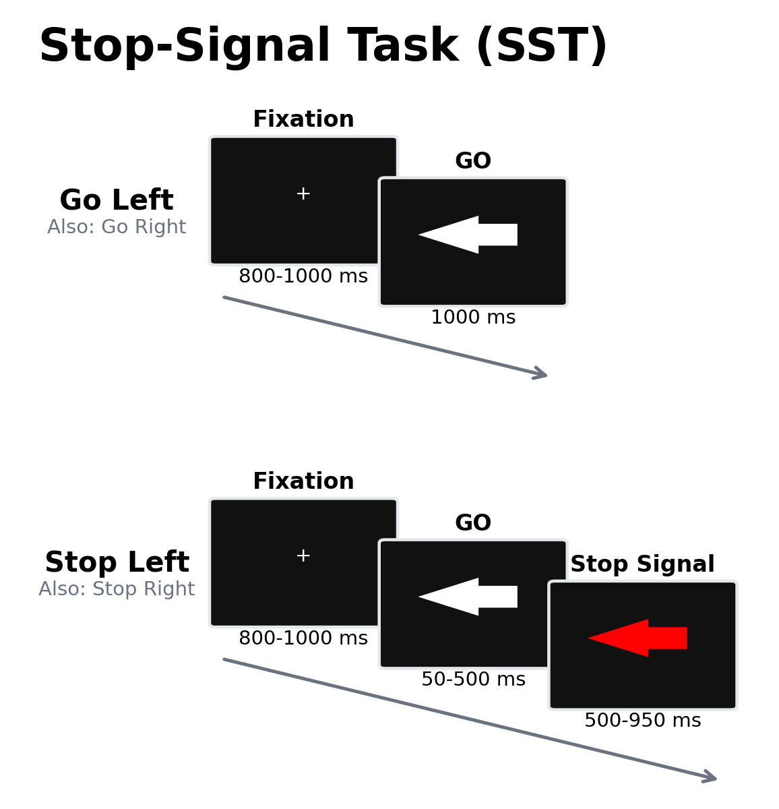

# 停止信号任务：反应取消的计算逻辑、神经时间进程与测量边界

行动已经启动之后能否被及时取消，是认知控制研究中的核心测量问题。成功停止以“没有反应”呈现，因而停止过程的潜伏期不能从单次行为直接观测；同时，停止信号的知觉、罕见事件定向、动作准备和错误监测均可能影响任务表现。停止信号任务（stop-signal task, SST）通过操纵执行信号与停止信号之间的间隔，并以执行与停止过程的相对完成时间解释成功率，提供了估计隐性停止速度的操作框架（Logan & Cowan, 1984）。该范式的价值由此取决于两方面：实验程序能否维持执行过程的速度与稳定性，以及赛马模型的假设能否在具体任务版本中成立。本文围绕范式起源、试次逻辑、行为与神经科学证据、应用进展及测量边界展开，并简述 TaskBeacon 的中文行为/EEG 实现。

## 1. 范式提出与理论基础

现代延迟停止程序在视觉反应启动后呈现第二信号，证明停止成功率随信号延迟增加而下降，并随原始反应时延长而上升（Lappin & Eriksen, 1966）。Logan 和 Cowan（1984）将这一规律形式化为独立赛马模型：执行刺激触发 go 过程，随后出现的停止信号触发 stop 过程；stop 先完成则反应被取消，go 先完成则产生未成功停止。该模型把停止信号反应时（stop-signal reaction time, SSRT）定义为不可直接观察的 stop 过程完成时间，并利用执行反应时分布、停止信号延迟（stop-signal delay, SSD）及停止试次反应概率进行估计。

模型包含重要的可检验前提。情境独立性要求 go 过程在有无停止信号时保持相同分布，随机独立性要求 go 与 stop 完成时间在给定条件下独立。由此，未成功停止试次主要来自 go 分布的较快部分，其反应时原则上应短于无停止信号的执行试次。模拟研究表明，动态 SSD、约 25% 的停止试次及充分的试次数有利于稳定估计，但遗漏、错误、反应时偏态与策略性减速仍会造成偏差（Band et al., 2003）。近期跨手动、眼动、听觉和视觉版本的研究发现，短 SSD 下情境独立性可出现系统性违背，选择性停止条件尤为明显；排除极短 SSD 后，部分推断会发生改变（Bissett et al., 2021）。因此，SSRT 是模型依赖的统计量，不能等同于直接记录的神经或运动停止时刻。

## 2. 任务逻辑、流程与核心参数

经典选择反应版 SST 以高比例执行试次建立优势反应。参与者对两个执行刺激作快速且准确的按键；少数试次在执行刺激之后呈现显著停止信号，要求取消尚未完成的反应。SSD 越长，go 过程越可能先完成。常用的一上一下阶梯在成功停止后延长 SSD、未成功停止后缩短 SSD，使停止成功率收敛于约 50%。这种校准既避免停止条件过易或过难，也使执行反应时分布与平均 SSD 可用于 SSRT 估计（Verbruggen et al., 2019）。停止信号应可辨识但不应预先指示；停止试次比例过高会强化等待策略，过低则降低 SSRT 与神经条件估计的精度。

主要因变量包括正确执行试次反应时与准确率、执行遗漏率、停止试次反应概率、各 SSD 下的抑制函数、平均 SSD 和 SSRT。共识指南推荐积分法：在排序后的执行反应时分布中，以停止试次反应概率确定分位点，再减去平均 SSD；执行遗漏需按预先规定的方法纳入分布，错误执行反应和极端值也须一致处理（Verbruggen et al., 2019）。平均法在反应时分布偏斜或策略性减速时容易产生虚假差异。除报告 SSRT 外，还应报告 go 反应时、遗漏、错误、停止成功率和未成功停止反应时，以检验阶梯收敛及模型假设。若刺激类别可能具有不同的辨别或反应选择时长，应使用分条件阶梯或证明共享阶梯不会造成系统偏移；研究者还应展示 SSD 分布和抑制函数，而不能仅以全程平均 SSD 作为阶梯有效的依据（Band et al., 2003; Verbruggen et al., 2019）。

试次阶段对应的心理构念需要严格区分。执行刺激至停止信号出现前主要涉及刺激辨别、反应选择与运动准备；停止信号出现后包含信号检测、注意重定向和反应取消；停止成功与失败之后还包含结果评价和跨试次策略调整。`成功停止 > 执行` 对比同时改变刺激频率、感觉事件数量和是否产生按键，不能单独识别“纯抑制”。预先知道可能停止会引发主动控制，表现为 go 反应减慢；停止信号出现后启动的取消过程则属于反应性控制（Verbruggen & Logan, 2009）。因此，策略性减速既可能是有意义的主动调整，也可能破坏以稳态 go 分布估计 SSRT 的条件，须依据研究问题分别建模。

SST 与 go/no-go 任务的构念范围也不宜互换。SST 在优势反应已经由 go 刺激启动后追加停止信号，核心估计针对行动取消的潜伏期；典型 go/no-go 任务则由单一刺激类别指示是否发起反应，更易混合规则选择、反应保持和预先抑制。两类任务可共同涉及控制网络，但在同一样本中的相关程度及神经时序未必一致。研究问题若指向已启动动作的快速取消，应优先保留延迟停止信号和可估计 SSRT 的设计；若关注形成或维持“不反应”规则，则不能以 SSRT 替代相应准确率指标（Verbruggen & Logan, 2009）。

## 3. 主要行为与神经科学发现

### 3.1 行为测量与停止过程分解

群体层面上，SSD 与停止成功率之间的单调关系及未成功停止反应时较短的模式，为赛马模型提供了基本支持（Logan & Cowan, 1984）。个体层面的停止表现仍包含至少三类来源：stop 过程速度、停止信号未能触发 stop 过程的概率，以及 go 过程随时间和停止情境发生的变化。使用连续鼠标轨迹的近期研究可在单试次上观察动作中止，并将 SSRT 变异与触发失败同标准赛马模型和贝叶斯分布模型比较；结果说明，相近的平均 SSRT 可能掩盖不同的触发可靠性或停止时间变异（Hannah et al., 2023）。SSD 本身也受反应选择时长影响，因而不能作为独立于 go 加工的抑制能力指标（Aksiotis et al., 2023）。

阶梯规则和测试环境会改变估计。Tran 等（2024）发现，维持 50% 与 66.67% 停止成功率的阶梯具有相近的区组内重测相关，但后者产生约 7 ms 更长的 SSRT，并减少因策略性减速而排除的区组；线上无监督测试的 go 反应时和 SSRT 均较慢。该结果支持阶梯条件内部的比较，却不支持把不同阶梯、设备或监督条件下的绝对 SSRT 直接合并。实验设计应在标准化、有效停止试次数和策略控制之间作出明确选择。

### 3.2 fMRI 与额叶—基底节网络

病灶研究显示，右侧额下回损伤程度与停止受损相关，为该区域参与行动取消提供了超越相关成像的证据（Aron et al., 2003）。事件相关 fMRI 进一步表明，成功停止相对于执行条件涉及右侧额下皮层、预辅助运动区及丘脑底核等节点，较快 SSRT 与部分节点的条件相关活动增强有关（Aron & Poldrack, 2006）。这些结果支持额叶—基底节网络参与快速动作更新，但 BOLD 信号的时间分辨率不足以确定节点启动顺序，也不能由脑区激活直接推出单一抑制功能。

任务特异的控制条件揭示了显著性检测这一替代解释。对经典 SST 加入罕见但无需停止的信号后，右侧额下区域在停止、监测和复杂目标检测条件中均可被募集，提示常用停止对比混入注意控制（Erika-Florence et al., 2014）。近期结合 MEG 与 fMRI 的研究使用注意需求更匹配的条件，观察到右侧额下回 β 频段活动先于预辅助运动区，并且定向连接与停止表现相关（Schaum et al., 2021）。这一证据提高了对额叶网络时序组织的约束，但仍来自条件对比与统计连接，不能将 β 活动视为个体抑制能力的充分生物标志物。

### 3.3 EEG/ERP 的时间进程

停止信号通常诱发额中央 N2 和 P3。成功停止试次的 P3 峰值可早于未成功停止试次，说明停止结果与刺激后数百毫秒内的电生理进程相关（Kok et al., 2004）。后续结合 EEG 与肌电的研究表明，运动输出开始衰减的时间可早于 P3 峰值，且 N2/P3 同时受停止概率、SSD、成功与否及主动控制调节（Raud & Huster, 2017）。因此，P3 的起始或峰值更适合描述停止信号加工和结果相关控制的时间进程，不应在缺少肌电或模型验证时直接解释为 stop 过程的完成时刻。头皮电位的空间定位同样不能替代 fMRI、病灶或颅内记录证据。

## 4. 范式发展与主要应用

SST 的方法学发展集中于标准化呈现、动态阶梯和模型估计。开放程序 STOP-IT 降低了选择反应版任务的实现差异，推动了跨实验复现（Verbruggen et al., 2008）；2019 年共识进一步把试次比例、SSD 跟踪、积分法、排除标准和完整报告统一为可检查建议（Verbruggen et al., 2019）。运动轨迹、肌电和分布模型则把平均 SSRT 扩展为停止过程变异与触发失败的分解，但这些指标尚未形成可跨版本直接互换的标准（Hannah et al., 2023）。

发展研究利用同一赛马逻辑区分总体反应变慢与停止效率变化。6—81 岁样本显示，执行速度和 SSRT 呈不同的年龄轨迹，确立了 SST 在儿童发展与认知老化研究中的应用价值（Williams et al., 1999）。临床研究则把较长 SSRT 用作群体水平的反应取消异常指标。例如，强迫症研究的元分析发现患者 SSRT 平均延长约 23 ms，而平均 go 反应时未见相应差异（Mar et al., 2022）。该效应支持群体关联，不能据此进行个体诊断；药物、共病、年龄、任务版本与数据排除规则均可能影响组间差异。

## 5. 信度、效度与解释边界

标准化 SST 的 SSRT 可达到中等重测稳定性。健康成人研究报告停止指标跨测量相关约为 .65—.73（Weafer et al., 2013），而不同区组、阶梯与环境下的可靠性会下降或改变（Tran et al., 2024）。稳定的平均组效应并不保证可靠的个体排序；认知任务为增强条件差异而压缩个体差异时，差值指标尤其容易出现“信度悖论”（Hedge et al., 2018）。用于纵向预测、临床分层或脑—行为相关时，应预先进行目标样本中的重测评估，并保证足够的有效停止试次。

构念效度取决于模型诊断，而非任务名称。停止成功率偏离目标、go 遗漏过多、明显减速、未成功停止反应时不短于 go 反应时，以及 SSD 大量停留在边界，均会削弱 SSRT 解释。短 SSD 下的独立性违背还提示，简单积分估计可能混合感觉交互和 go 过程变化（Bissett et al., 2021）。神经对比须控制停止信号的罕见性和显著性；临床组差异须同时报告 go 表现及模型质量。现有证据支持 SST 测量特定程序下的反应取消效率，尚不足以把单次 SSRT 概括为跨情境的“冲动控制能力”，也不足以从相关脑活动作出因果机制判断。

## 6. TaskBeacon 中的任务实现

### 6.1 任务资源与访问入口

| 资源 | ID | 用途 | 地址 |
|---|---|---|---|
| 完整实验源码 | T000012 | 中文行为/EEG 采集实现 | [https://github.com/TaskBeacon/T000012-sst](https://github.com/TaskBeacon/T000012-sst) |
| 浏览器预览源码 | H000012 | 与 T 版试次语义一致、区组与试次数缩短的行为预览 | [https://github.com/TaskBeacon/H000012-sst](https://github.com/TaskBeacon/H000012-sst) |

H000012 仓库将自身标记为 HTML/browser preview，并未把浏览器版本表述为 EEG 采集版的等价替代。其公开元数据仅给出本地开发地址；截至核验时无法确认可公开直达的在线运行入口。

### 6.2 实现流程与关键参数

TaskBeacon 当前版本采用左、右白色箭头作为执行刺激，分别以 F、J 键反应；停止试次中，同向箭头在 SSD 后变为红色。任务包含 3 个区组，每区组 70 个试次。条件生成器按每区组约 25% 的比例取整为 18 个停止试次，并令每区组前三个试次为执行试次。

| 环节 | 当前实现 |
|---|---|
| 注视 | 在 0.8—1.0 s 之间取样 |
| 执行/停止窗口 | 自箭头出现起总计 1.0 s |
| 停止信号 | 视觉颜色变化；初始 SSD 0.25 s，范围 0.05—0.50 s |
| 反应与反馈 | 白色左/右箭头按 F/J；红色箭头出现后停止；go 遗漏后反馈 0.8 s；无积分奖励，区组后反馈 go 击中率和停止成功率 |
| SSD 调整 | 左右方向共用；步长 0.05 s；累计停止成功率高于 .50 时延长，否则缩短 |
| 记录与同步 | 记录条件、阶段反应及逐试次 SSD，并为注视、go、stop、反应和遗漏设置 EEG 事件标记 |

**图 1. TaskBeacon 当前 SST 的试次流程。** 每个试次先呈现 0.8—1.0 s 注视。执行条件呈现白色左/右箭头，参与者须在 1.0 s 内分别按 F/J；遗漏触发 0.8 s 提示。停止条件先在当前 SSD 内呈现同向白色箭头，随后变为红色，并在从 go 起算的剩余 1.0 s 窗口内要求不按键；SSD 前或红色阶段出现反应均计为停止失败，无反应计为停止成功。控制器以 0.25 s 起始，左右方向共享 0.05—0.50 s 范围内的 SSD；累计停止成功率高于 50% 时增加 0.05 s，否则减少 0.05 s。

该累计成功率规则与经典逐试次一上一下阶梯存在方法差异：当前 SSD 更新取决于完整既往停止历史，而不只取决于刚完成试次。分析时应保留逐试次 SSD，检查成功率、边界停留和区组内稳定性。当前运行流程提供 go/stop 正确率、反应时和 SSD 等原始结果，但现有仓库文件无法确认预设的 SSRT 积分算法；研究者需在分析方案中明确估计方法、遗漏处理及模型诊断。

## 参考文献

Aksiotis, V., Myachykov, A., & Tumyalis, A. (2023). Stop-signal delay reflects response selection duration in stop-signal task. *Attention, Perception, & Psychophysics, 85*(6), 1976–1989. https://doi.org/10.3758/s13414-023-02752-y

Aron, A. R., Fletcher, P. C., Bullmore, E. T., Sahakian, B. J., & Robbins, T. W. (2003). Stop-signal inhibition disrupted by damage to right inferior frontal gyrus in humans. *Nature Neuroscience, 6*(2), 115–116. https://doi.org/10.1038/nn1003

Aron, A. R., & Poldrack, R. A. (2006). Cortical and subcortical contributions to stop signal response inhibition: Role of the subthalamic nucleus. *The Journal of Neuroscience, 26*(9), 2424–2433. https://doi.org/10.1523/JNEUROSCI.4682-05.2006

Band, G. P. H., van der Molen, M. W., & Logan, G. D. (2003). Horse-race model simulations of the stop-signal procedure. *Acta Psychologica, 112*(2), 105–142. https://doi.org/10.1016/S0001-6918(02)00079-3

Bissett, P. G., Jones, H. M., Poldrack, R. A., & Logan, G. D. (2021). Severe violations of independence in response inhibition tasks. *Science Advances, 7*(12), eabf4355. https://doi.org/10.1126/sciadv.abf4355

Erika-Florence, M., Leech, R., & Hampshire, A. (2014). A functional network perspective on response inhibition and attentional control. *Nature Communications, 5*, 4073. https://doi.org/10.1038/ncomms5073

Hedge, C., Powell, G., & Sumner, P. (2018). The reliability paradox: Why robust cognitive tasks do not produce reliable individual differences. *Behavior Research Methods, 50*(3), 1166–1186. https://doi.org/10.3758/s13428-017-0935-1

Hannah, R., Muralidharan, V., & Aron, A. R. (2023). Failing to attend versus failing to stop: Single-trial decomposition of action-stopping in the stop signal task. *Behavior Research Methods, 55*, 4099–4117. https://doi.org/10.3758/s13428-022-02008-x

Kok, A., Ramautar, J. R., De Ruiter, M. B., Band, G. P. H., & Ridderinkhof, K. R. (2004). ERP components associated with successful and unsuccessful stopping in a stop-signal task. *Psychophysiology, 41*(1), 9–20. https://doi.org/10.1046/j.1469-8986.2003.00127.x

Lappin, J. S., & Eriksen, C. W. (1966). Use of a delayed signal to stop a visual reaction-time response. *Journal of Experimental Psychology, 72*(6), 805–811. https://doi.org/10.1037/h0021266

Logan, G. D., & Cowan, W. B. (1984). On the ability to inhibit thought and action: A theory of an act of control. *Psychological Review, 91*(3), 295–327. https://doi.org/10.1037/0033-295X.91.3.295

Mar, K., Townes, P., Pechlivanoglou, P., Arnold, P., & Schachar, R. (2022). Obsessive compulsive disorder and response inhibition: Meta-analysis of the stop-signal task. *Journal of Psychopathology and Clinical Science, 131*(2), 152–161. https://doi.org/10.1037/abn0000732

Raud, L., & Huster, R. J. (2017). The temporal dynamics of response inhibition and their modulation by cognitive control. *Brain Topography, 30*(4), 486–501. https://doi.org/10.1007/s10548-017-0566-y

Schaum, M., Pinzuti, E., Sebastian, A., Lieb, K., Fries, P., Mobascher, A., Jung, P., Wibral, M., & Tüscher, O. (2021). Right inferior frontal gyrus implements motor inhibitory control via beta-band oscillations in humans. *eLife, 10*, e61679. https://doi.org/10.7554/eLife.61679

Tran, D. M. D., Chowdhury, N. S., Harris, J. A., & Livesey, E. J. (2024). The effect of staircase stopping accuracy and testing environment on stop-signal reaction time. *Behavior Research Methods, 56*(1), 500–509. https://doi.org/10.3758/s13428-022-02058-1

Verbruggen, F., Aron, A. R., Band, G. P. H., Beste, C., Bissett, P. G., Brockett, A. T., Brown, J. W., Chamberlain, S. R., Chambers, C. D., Colonius, H., Colzato, L. S., Corneil, B. D., Coxon, J. P., Dupuis, A., Eagle, D. M., Garavan, H., Greenhouse, I., Heathcote, A., Huster, R. J., . . . Boehler, C. N. (2019). A consensus guide to capturing the ability to inhibit actions and impulsive behaviors in the stop-signal task. *eLife, 8*, e46323. https://doi.org/10.7554/eLife.46323

Verbruggen, F., & Logan, G. D. (2009). Models of response inhibition in the stop-signal and stop-change paradigms. *Neuroscience & Biobehavioral Reviews, 33*(5), 647–661. https://doi.org/10.1016/j.neubiorev.2008.08.014

Verbruggen, F., Logan, G. D., & Stevens, M. A. (2008). STOP-IT: Windows executable software for the stop-signal paradigm. *Behavior Research Methods, 40*(2), 479–483. https://doi.org/10.3758/BRM.40.2.479

Weafer, J., Baggott, M. J., & de Wit, H. (2013). Test–retest reliability of behavioral measures of impulsive choice, impulsive action, and inattention. *Experimental and Clinical Psychopharmacology, 21*(6), 475–481. https://doi.org/10.1037/a0033659

Williams, B. R., Ponesse, J. S., Schachar, R. J., Logan, G. D., & Tannock, R. (1999). Development of inhibitory control across the life span. *Developmental Psychology, 35*(1), 205–213. https://doi.org/10.1037/0012-1649.35.1.205
